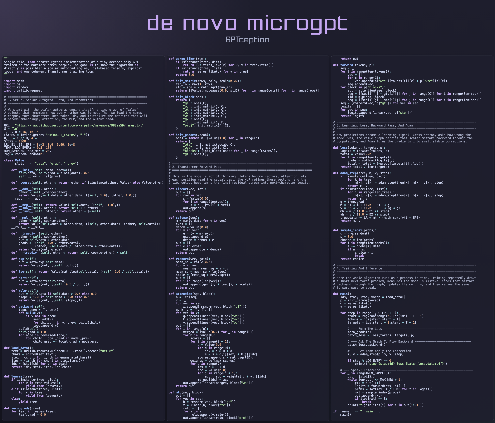

# microgpt-denovo

[](https://entrpi.github.io/microgpt-denovo/)

Live three-column view of either implementation (interactive, with display settings): [https://entrpi.github.io/microgpt-denovo/](https://entrpi.github.io/microgpt-denovo/)

This readme is the only hand-written file in this repo.

I started this project after watching [Andrej Karpathy&#39;s recent interview on No Priors](https://youtu.be/kwSVtQ7dziU?si=yMaHgEizVzWvKano&t=3689) where he explained that he had to hand-write `microgpt`, a 200-line GPT implementation in Python which distills the essence of all the algorithms behind creating Transformers, because the LLMs he asked weren't able to do it.

I wanted to test if this is still true: whether a "microgpt" in that spirit could be brought into existence with minimal manual intervention, just clear expression of intent to an LLM.
This is an experiment not just in producing a tiny GPT artifact, but in seeing how close you can get to the essence of microgpt just through careful prompting, without writing a single line yourself.

Most Transformer codebases are optimized for scale, performance, flexibility, or framework ergonomics.
Those are worthwhile goals, but they often hide the actual learning algorithm behind layers of abstraction.
What `microgpt` aims for is different: a single-file presentation of the core algorithmic elements of training and inferencing a GPT-style decoder, written as tersely as possible without losing the thread of the ideas.

This task means every major mechanism should appear directly on the page: tokenization, embeddings, causal self-attention, residual connections, normalization, MLP, cross-entropy, backpropagation, Adam, and autoregressive sampling.
If a detail can be derived from more basic choices, I want it derived.
If a symbol can be explained in plain language, I want it explained.
If a convenience abstraction hides the algorithm, I want to remove it.

You can see in the dialog below my very-first-attempt conversation with ChatGPT 5.4 xhigh in Codex App on Mar 23, 2026 which produced the files below:

- `microgpt.py`: a validated Python implementation with a from-scratch scalar autograd engine and explicit chain-rule edges.
- `microgpt_matrix.jl`: a validated Julia implementation of the matrix-calculus version with explicit forward and backward passes.

I was inspired to go in the matrix math direction for speed when writing my own [EEmicroGPT](https://github.com/Entrpi/eemicrogpt), which is the fastest implementation of `microgpt`, but does not aim for brevity or clarity. I was inspired to make that brief and clear too after seeing [ssrhaso/microjpt](https://github.com/ssrhaso/microjpt).

Now the closest thing to "code" contributed to the files is just the initial constants, data, and constraints to give the model the same shape as Karpathy's microgpt. The rest was left to the agent, with further guidance being directed at elements of style and structure at a high level.

## Dialog

The following dialog produced the current artifacts.

```text
User:
Hello. In this directory our project is to implement the core algorithmic elements of training and inferencing a GPT Transformer model in a terse but pedagogically motivated manner. That means we want to distill just the essential elements of the algorithms into as few well-documented lines of code as possible. It should be a single file with the complete algorithm.

We will train against a list of names: https://raw.githubusercontent.com/karpathy/makemore/988aa59/names.txt

Tokenize each unique char in dataset.
We will use Autograd, a tiny model (1 layer, 16 wide embedding, blocks of 16, 4 heads.
Follow GPT-2 with minor differenes: layernorm -> rmsnorm, no biases, GeLU -> ReLU
Use Adam optimizer.
Train 1000 steps.
Run inference at 0.5 temperature

It's possible to do this in real code, including comment lines and a generous header block in between 80 and 200 lines depending on the language used. Try with pseudocode first.

Assistant:
I added a single-file pseudocode draft at `microgpt_pseudocode.py`. It’s 158 lines and includes the full path end to end: download/tokenize the names corpus, initialize a 1-layer 16-wide 4-head decoder-only GPT, train with Adam for 1000 steps, and sample at temperature `0.5`.

The main modeling choice is to train on the raw newline-delimited character stream, so `'\n'` becomes a real token and doubles as the boundary token for sampling. That keeps the code short and avoids introducing extra BOS/PAD machinery while still matching the dataset cleanly.

I did not run it as code; it is intentionally Python-shaped pseudocode, not yet a verified executable Autograd implementation. If you want, I can turn this directly into the real single-file Autograd version next.

User:
Now instead of Autograd what about pure matrix math? Don't constrain pseudocode to what Python can do. Perhaps the abstractions of Julia or other more mathematically oriented languages would give a cleaner pseudocode basis. It should be possible to express in under 100 clear (pedagogical, not minified) lines.

Assistant:
Yes. A Julia-like matrix-calculus pseudocode basis is cleaner for this teaching goal because it lets the file talk in terms of tensor primitives instead of Python/autograd mechanics.

I added a 90-line version at `microgpt_matrix_pseudocode.jl`. It keeps the whole story in one place: char-stream tokenization over the raw names corpus, tied embeddings, 1-block causal self-attention, RMSNorm, ReLU MLP, explicit backward passes for RMSNorm/attention/block/output, Adam, and temperature-0.5 sampling from `'\n'` to `'\n'`. The remaining abstractions like `bmm`, `embed`, `embed_scatter`, `pick`, and `softmax_last` are intentionally mathematical primitives rather than language-specific code.

I left the earlier Python-shaped draft in `microgpt_pseudocode.py` for comparison. If you want, I can next collapse the matrix version a bit further, or turn this exact pseudocode into a real executable single-file implementation in Julia or pure NumPy with manual backprop.

User:
Every line should have a comment block in a second column explaining what's happening there and why, succinctly and clearly

Assistant:
Updated `microgpt_matrix_pseudocode.jl` so every line now has a right-hand comment explaining both what it does and why it is there. The file stays in the same Julia-like matrix-calculus style, with explicit forward/backward passes and a small set of assumed tensor primitives such as `bmm`, `embed`, `embed_scatter`, and `softmax_last`.

The per-line annotation pushes it to 112 lines, so it no longer fits the earlier sub-100 target without sacrificing clarity. If you want, I can do a second pass to compress it back toward 100 while preserving the two-column comment format.

User:
For the matrix pseudocode, use more lines for optimal clarity. Don't densely pack.

Assistant:
Expanded `microgpt_matrix_pseudocode.jl` into a much less dense version. It now uses one small step per line, keeps the right-hand explanatory comment on every line, and spreads the backward pass and gradient assembly out so the control flow is easier to follow.

It’s now 205 lines, which is the tradeoff for clarity. I did not run anything, since this file is still intentionally language-like pseudocode rather than executable Julia. If you want, I can next do one of two things: turn this exact expanded pseudocode into a real single-file implementation, or tighten just the helper layer while keeping the rest in this clearer style.

User:
Have we made everything which should be derived so?

Assistant:
Not fully before; mostly yes now.

I updated `microgpt_matrix_pseudocode.jl` so the main duplicated facts are now derived instead of restated:
- `S = '\n'` introduces a single named boundary token.
- `D = C ÷ H` derives head width instead of hard-coding it.
- `F = 4 * C` derives MLP width instead of hard-coding it.
- `MAX_NEW = T` derives the sampling cap from context length.
- Sampling now uses `S` instead of repeating raw newline literals.

What remains as literals is mostly intentional config rather than something that should be derived:
- `T`, `C`, `H` are core architectural choices.
- `B`, `STEPS`, `LR`, `B1`, `B2`, `EPS` are optimizer/training hyperparameters.
- `0.5` temperature, `20` samples, and `100` logging cadence are presentation/runtime choices.

If you want maximum consistency, the next cleanup would be to name those last three as constants too, even though they are not really derived quantities.

User:
The comments read more as technical notes on your editing choices than a story told to a student trying to understand GPT algorithms.

Assistant:
Rewrote the right-hand comments in `microgpt_matrix_pseudocode.jl` so they explain the algorithm as a student would read it: what embeddings mean, what queries/keys/values are doing, why residuals exist, how cross-entropy gives `probs - onehot`, and how Adam turns gradients into updates.

The code path is essentially unchanged; the shift is in voice and emphasis. I did not run anything, since this remains pseudocode. If you want, I can do one more pass specifically to make the comments read like a continuous lecture narrative rather than line-by-line local explanations.

User:
Now let's use uv and python 3.14 to validate and rectify any issues with the Python code

Assistant:
Validated `microgpt_pseudocode.py` under `uv` on CPython 3.14.1 with `autograd`, fixed the actual runtime break, and confirmed the full default training run works.

The real code issue was in attention: `autograd`’s traced arrays do not support method-style variadic `.transpose(...)`. I replaced those calls with explicit `np.transpose(..., axes)`, and I updated the header text so it no longer claims to be only pseudocode.

Validation results:
- `uv run --python 3.14 --with autograd python -m py_compile ...` passed.
- A short smoke run passed.
- The full default `1000`-step run passed.
- Loss printed from `2.6077` at step 100 down to `2.1879` at step 1000.

User:
Now rename to not include pseudocode and make the same pass with Julia

Assistant:
Renamed the sources to `microgpt.py` and `microgpt_matrix.jl`, and updated `README.md` so the current artifact names and status match reality while leaving the transcript historical.

The Julia side is no longer pseudocode. I replaced the placeholder tensor primitives with real code: data loading via `Downloads`, a concrete `Params` container, embedding lookup/scatter, batched matmul helpers, explicit RMSNorm/attention/block forward and backward passes, Adam, and sampling. It runs cleanly under Julia 1.12.5 with no external Julia packages.

Validation:
- `microgpt.py` passes `uv run --python 3.14 --with autograd python -m py_compile ...` and the full 1000-step training run.
- `microgpt_matrix.jl` passes a smoke test and the full 1000-step training run.

User:
Now a couple issues remain:
First, the Julia implementation is better documented than the Python implementation.
Second, both aren't really structured to delineate the different major sections or stages of the algorithms. It should be clearer at a glance where responsibilities break.

Assistant:
Updated both implementations to make the algorithm stages easier to scan and to bring the Python file closer to the Julia file’s teaching quality.

In `microgpt.py`, I added explicit stage boundaries for setup, data/parameters, math primitives, model, loss/gradients, batching/optimization/sampling, and the script entrypoint. I also expanded the inline comments around attention, the forward pass, cross-entropy, Adam, and sampling so the file explains the model’s flow instead of just naming operations.

In `microgpt_matrix.jl`, I added the same kind of section headers so the major responsibilities break cleanly at a glance: setup, parameter container, data/init, tensor helpers, model components, loss/gradients, batching/optimization, and train/sample.

User:
Write this as a pedagogical script, not as a normal source file.

Organize the file by the learner’s conceptual journey through the algorithm:
1. setup
2. data and tokenization
3. parameter initialization
4. forward pass
5. loss
6. backward pass or learning signal
7. optimizer
8. training loop
9. inference

Use explicit visual section markers to divide the top level ideas (setup, training, inference, etc.).

Prefer a few large algorithm-shaped blocks over many small helpers.
Only extract a helper if it corresponds to a real conceptual primitive like RMSNorm or softmax.
Do not structure the file like a library, utility module, or maintainable package.

Optimize for “glanceability”:
a student should be able to scan the file and immediately see where forward, loss, backward, optimizer, and sampling live.

Comments should tell the story of what the model is doing and why, from the learner’s perspective.
Do not comment on coding style, refactoring choices, abstraction choices, or implementation hygiene.
Avoid comments that sound like editor notes.

Prefer top-down narrative sequencing over engineering-normal decomposition.
It is acceptable to use globals, in-place mutation, and denser coupling if that makes the algorithm easier to read as one coherent artifact.

Make the file feel like a lecture demonstration or mathematical performance.
The code should read like:
“here is the data, now here is the forward pass, now here is how it learns, now here is how it speaks.”

Assistant:
Restructured both `microgpt.py` and `microgpt_matrix.jl` so the file reads more like a lecture script than a module.

The top-level section markers now follow that learner journey much more directly: setup, data and tokenization, parameter initialization, forward pass, loss, backward pass or learning signal, optimizer, training loop, and inference.

On the Python side, I also strengthened the local comments so the forward path, learning signal, optimizer step, and sampling loop explain what the model is doing, not just what each line computes. On the Julia side, I aligned the section names to the same conceptual sequence and made the training and inference boundaries explicit instead of bundling them together.

User:
For Python:
Even if autograd handles backward, preserve a visible “learning” act.
Make it obvious where the loss is formed, where gradients are requested, and where Adam updates the parameters.
Do not let autograd erase the narrative structure of training.

Assistant:
Updated `microgpt.py` so the learning act stays visible even with `autograd`.

The training loop now first forms the batch loss, then requests gradients through a named `backward` function, then lets Adam update the parameters. I also made the loss formation itself explicit inside `loss(...)` and the gradient request explicit inside `learning_signal(...)`.

User:
For both:
Value narrative coherence over modular purity.
If forced to choose, prefer fewer bigger sections that mirror the canonical Transformer algorithm.

Assistant:
Updated both implementations to favor bigger algorithm-shaped sections over module-like decomposition.

The top level is now just four large sections: setup/data/parameters, Transformer forward pass, learning, and training/inference. In the Julia file I also removed a few obvious utility-style helpers by inlining them into the main algorithm where that improved coherence, for example the true-probability gathering in the loss and categorical sampling in inference.

User:
Now also for each major section include a brief header paragraph explaining each section.

Assistant:
Added brief header paragraphs under each top-level section marker in both `microgpt.py` and `microgpt_matrix.jl`. Each section now opens with a short orientation block that explains, in lecture style, what that stage of the algorithm is about before the code begins.

User:
Let's implement proper autograd from scratch in the py version. We shouldn't be hiding key algorithms.
- Standard library only. No numpy
- Write a scalar Value class from scratch for autograd.
- All tensors must be represented as Python lists / nested lists of Value objects.
- Use explicit Python loops for linear layers, attention, softmax, RMSNorm, MLP, backward, and Adam.
- Prefer minimal code and conceptual atomicity over batching, speed, reuse, or tensor abstraction.
- It should feel like the most reduced executable statement of GPT possible.

Assistant:
Replaced the Python implementation with a standard-library-only scalar autograd version. The file now uses a hand-built `Value` class, nested Python lists of `Value` objects for tensors, explicit loops for the model blocks, and Adam over the same list-shaped parameter tree.

User:
The whole autograd engine should fit cleanly into 45 lines or less if implemented succinctly (but not minified, still pedagogical)

Assistant:
Compressed the scalar `Value` engine down to 44 lines and validated that the shorter backward walk still works.

User:
Can we do similar brevity refactors across the rest of the file? Remember, don't compromise explanatory power, but fine to move description to a comment if needed.

Assistant:
Tightened the rest of the Python file in the same spirit by trimming tree-utility boilerplate and moving a little more explanation into the section comments.

User:
The Python file is hugely undercommented relative to Julia, and the autograd should be more clearly marked.

Assistant:
Added more narrative comments around the Python forward pass, loss, Adam step, and sampling path, and made the scalar `Value` engine read more explicitly as the autograd core.

User:
Let's fully refactor our autograd to be shorter and clearer.

Important:
Choose the representation that makes backward propagation look like `child.grad += local_grad * node.grad`.
Do not optimize for abstraction reuse inside the autograd engine; optimize for the student’s mental model of the chain rule.

Assistant:
Refactored the Python autograd engine around explicit edges of the form `(child, local_grad)`.

The old `_binary(...)`, `_unary(...)`, and `_backward` closure machinery is gone. Each operator now states its own local derivative directly, and the backward pass literally loops over stored edges and applies the chain rule as `child.grad += local_grad * node.grad`. That made the autograd block both shorter and easier to read as mathematics.

User:
Let's review the whitespace and comments to make sure they flow neatly. Avoid adding any more newlines for comments. Most comments should be along a second column that runs across the right of the document.

Assistant:
Cleaned up the Python file so the comments read more consistently as a right-hand second column.

User:
Our model has no ability to add layers.

Assistant:
Added real layer support to both implementations.

In `microgpt.py`, `LAYERS` is now a real architecture setting, the parameter tree stores a `blocks` list, and the forward pass loops across those blocks instead of hardcoding one attention-plus-MLP block. In `microgpt_matrix.jl`, the same idea now appears as a `BlockParams` vector inside `Params`, with forward pass, backward pass, Adam, and zero-filled optimizer buffers all iterating across the layer stack. Both files were then smoke-tested with `2` layers to confirm the new depth path actually runs.

User:
Can we address this issue with MLP?
With linear(vec, mat) interpreting mat as [out_dim][in_dim], fc and proj are reversed. Your comments say C -> F -> C, but the code does not implement that.
Change to fc = init_matrix(F, C) and proj = init_matrix(C, F).

Assistant:
Fixed the MLP shape bug in `microgpt.py`.

`fc` now initializes as `init_matrix(F, C)` so it really expands `C -> F`, and `proj` now initializes as `init_matrix(C, F)` so it contracts `F -> C` back into the residual stream. I also aligned `init_matrix(...)` with the same `[out_dim][in_dim]` convention by treating `cols` as the true fan-in. The Julia implementation was left unchanged because its `Y = XW` matrix convention was already consistent.
```

## Status

This repository now contains two verified runnable implementations:

- `microgpt.py` runs on stock CPython (3.14 tested, standard library only) and uses a hand-rolled scalar `Value` autograd engine whose backward pass follows explicit `(child, local_grad)` edges. It trains on one context window per step: the scalar engine trades speed for transparency.
- `microgpt_matrix.jl` runs under Julia 1.12 with no external Julia package dependencies. It trains on 64-window minibatches, so its printed losses are not directly comparable to the Python file's.

Both train for 1000 steps on the raw newline-delimited names stream and then sample names at temperature `0.5`. Both read the same `MICROGPT_LAYERS`, `MICROGPT_STEPS`, `MICROGPT_TEMP`, `MICROGPT_LOG_EVERY`, and `MICROGPT_SAMPLES` environment overrides for quick experiments.

## Concept Map

Both implementations teach the same ladder of ideas, and every rung stands only on the rungs below it. This is the order in which the concepts depend on each other — not necessarily the order the files present them (more on that at the end).

1. **Raw materials.** Text is one long stream of characters, and tokenization just numbers the unique ones (`stoi`/`itos`). Newline is the only special token: it separates names in the corpus, and later tells sampling where names start and stop. The task is next-token prediction: the input is a window of characters and the target is the same window shifted by one — so every position in the window is its own training example.

2. **Tokens become geometry.** Each token id selects a learned row of the embedding matrix, each slot adds a learned position vector, and their sum starts the residual stream: one vector per position that everything afterward only nudges. Weights begin at scale 1/√fan-in so the first forward pass produces numbers of size roughly one.

3. **One Transformer block.**
   - A linear layer is a bank of dot products, one row per output channel.
   - RMSNorm divides each vector by its own typical size and lets every channel relearn a scale, keeping the stream stable at any depth.
   - Attention projects the same vector three ways: a query (what is this position looking for?), a key (what does it offer?), and a value (what content would it hand over?). A large query–key dot product means "this past token matters now"; dividing by √D keeps softmax gentle; the future is hidden (a loop bound in Python, a `-1e9` mask in Julia); softmax turns scores into weights; and the result is a weighted average of values — soft copying from the visible past. Heads run this in parallel on separate channel slices.
   - The MLP expands each position four-fold, applies ReLU, and contracts back: per-position refinement of what attention just gathered.
   - Every branch is added to the stream, never substituted: blocks learn corrections. That is also why blocks can stack.

4. **Scoring and surprise.** The finished stream is scored against the vocabulary by the same matrix that embedded it (the tied head). Softmax makes a distribution, and cross-entropy charges the model its surprise, `-log p`, at the true next character. This pairing has a famous reward: the gradient at the logits is simply `probs - onehot`. The Julia file writes that line explicitly; the Python engine rediscovers it numerically.

5. **Learning.** A gradient assigns blame — how much each number contributed to the mistake — and the chain rule (local derivative times upstream gradient, accumulated) propagates it. This repo realizes the chain rule twice:
   - `microgpt.py`: every scalar operation records `(child, local_grad)` edges as it runs, so the tape builds itself and `backward()` walks it in reverse.
   - `microgpt_matrix.jl`: every forward function saves its intermediates onto an explicit tape, and a hand-derived partner function replays it in reverse.

   Adam then keeps a running memory of each parameter's gradient direction and scale, repairs the zero-start bias in both memories, and takes a step sized to the gradient's own typical magnitude.

6. **Speaking.** Inference feeds the model its own output. Start at the boundary token (training taught the model that what follows a newline is how names begin), read only the last position's distribution, sharpen it with temperature below one, sample by inverting the CDF, and stop at the next boundary or when the context window fills.

The two files walk this ladder by different, equally valid routes. `microgpt.py` is tools-first: it builds rung 5's scalar engine before anything else, because every number that follows is made of those self-remembering scalars — learning later costs one call. `microgpt_matrix.jl` is task-first: it climbs rungs 1–4 as written, then takes rung 5 as a full chapter of explicit matrix calculus. Both files share the same four-act structure (setup, data, and parameters; the forward pass; learning; training and inference) and the same vocabulary throughout: queries ask, keys offer, cross-entropy is surprise, gradients hand back blame, updates are corrections.

## Epilogue

After the files were finalized, I let ChatGPT compare them directly to the two inspiration points: [ssrhaso/microjpt](https://github.com/ssrhaso/microjpt/blob/main/microjpt.jl) on the Julia side, and [Karpathy&#39;s `microgpt.py` gist](https://gist.github.com/karpathy/8627fe009c40f57531cb18360106ce95#file-microgpt-py) on the Python side.

**User:** How does our Julia compare to https://github.com/ssrhaso/microjpt/blob/main/microjpt.jl in terms of how it is divided into sections and functions?

**Assistant:** As of March 23, 2026, the current [`microjpt.jl`](https://github.com/ssrhaso/microjpt/blob/main/microjpt.jl) is more theatrical and more monolithic than our [`microgpt_matrix.jl`](microgpt_matrix.jl).

- Sectioning: `microjpt.jl` is divided as `PROLOGUE`, `ACT I-IV`, `SCENE`, and `FINALE`. Ours uses four numbered teaching blocks with short intro paragraphs: setup/data/parameters, forward pass, learning, and training/inference.
- Function division: `microjpt.jl` keeps most of the algorithm inside a few large functions: `fwd`, `celoss`, `bwd!`, `adam_step!`, and `infer`. Ours is more decomposed into conceptual primitives like `rms_fwd`/`rms_bwd`, `attn_fwd`/`attn_bwd`, `block_fwd`/`block_bwd`, `loss_and_grad`, `adam!`, and `main`.
- Execution shape: `microjpt.jl` puts the training loop directly at top level and then runs inference after it. Ours wraps execution in `main()`, so the teaching stages are visually grouped but slightly less "single scroll of action."
- Net effect: `microjpt.jl` is flatter and bolder as a one-page performance. Our Julia file is more scan-friendly if the student wants to isolate where forward, backward, loss, optimizer, and inference live, but it is still more function-split than `microjpt.jl`.

So in short: our sectioning is clearer; `microjpt`'s function layout is more aggressively collapsed. If you want to move our Julia closer to `microjpt` structurally, the next step would be to inline more of `block_fwd`/`block_bwd`, `batch`, and `adam!` into the main narrative.

**User:** Now how does our Python compare to https://gist.github.com/karpathy/8627fe009c40f57531cb18360106ce95#file-microgpt-py

**Assistant:** As of Karpathy's gist last active on March 22, 2026, his [`microgpt.py` gist](https://gist.github.com/karpathy/8627fe009c40f57531cb18360106ce95#file-microgpt-py) is more monolithic and more "single breath" than our [`microgpt.py`](microgpt.py).

It keeps the scalar autograd engine, model, training loop, and inference in one unfolding script, with a single `gpt(...)` core and doc-by-doc execution. Our current [`microgpt.py`](microgpt.py) is more deliberately staged: the 44-line `Value` autograd engine is isolated up front, then the file moves through data, primitives, model blocks, loss, Adam, and `main`.

The biggest difference is how explicit the teaching surface is. Karpathy's `Value` class is a bit more direct about local derivatives via stored child/gradient pairs, and his script runs one document at a time with BOS tokens plus cached `keys`/`values` during autoregressive decoding. Our file is more comment-heavy and sectioned, trains on fixed windows from the raw newline stream, and recomputes the forward pass during sampling. So the gist is the tighter one-page performance; ours is the clearer lecture script.

So in short:

- Karpathy's file is more atomically minimal and more monolithic.
- Our file is more sectioned, more glanceable, and more classroom-script-like.
- His gist is the stronger demonstration of "I can build GPT and autograd from scratch in one page."
- Ours is the stronger demonstration of "I can build GPT and scalar autograd from scratch while also teaching the Transformer algorithm as a clearly segmented narrative."

## Revisions

On July 10, 2026, a review pass by Claude (Fable 5) — still with no hand-written code — tightened both implementations and the viewer:

- Fixed a sampling off-by-one in both files: the length cap allowed one token beyond `MAX_NEW`, and when a name hit the cap without reaching a boundary its final character was silently dropped from the printed output.
- Aligned the Python initialization with the Julia scheme (`1/sqrt(fan_in)` in both), gave the Python file the same `MICROGPT_*` environment overrides as Julia, and inlined categorical sampling into the Python inference loop to mirror the Julia structure.
- In Julia, collapsed Adam into one shared `adam_update!` recipe used by every tensor, renamed hidden-state locals that shadowed the head-count constant `H`, hoisted the causal mask into a constant, merged the duplicate softmax methods, and named the id-to-char mapping `itos` at its definition.
- In the viewer, display mode and comment mode now persist across reloads like the other settings, window resizing rescales type without re-highlighting, fetch errors report their actual cause, and a settings toggle can display `microgpt_matrix.jl` with Julia-aware highlighting.

A second pass the same day rebuilt the presentation around a concept-dependency map of the algorithm — which concepts a student must hold before each next one makes sense:

- The two files now declare their two different-but-valid paths through that map: `microgpt.py` is tools-first (meet the self-differentiating number, then build everything from it), `microgpt_matrix.jl` is task-first (build the model, then derive every gradient by hand). Each file's header explains its path and points at the other.
- In the Julia file, the backward passes moved out of the forward-pass section into the learning section, so the four acts now scan cleanly as data, forward, learning, and running; `batch` moved beside the training loop it serves; and the duplicated training-time forward pass was replaced by one shared `forward` that returns logits plus a tape of intermediates that learning replays in reverse.
- Comments in both files were rewritten so each concept is introduced exactly once, at first use, with matched vocabulary across the two implementations (queries ask, cross-entropy is surprise, gradients hand back blame, updates are corrections), and misplaced or missing explanations — causality on the wrong loop, the untied-head silence at the logits, why sampling starts at a newline, what temperature does, why Adam repairs its zero-start bias — were fixed.
- The dependency map itself, rewritten for students, was added to this README as the Concept Map section.
